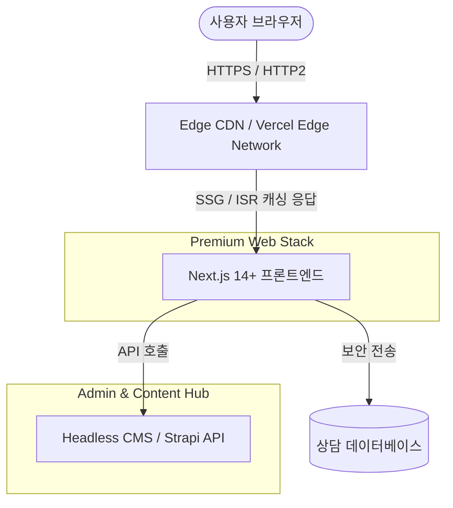

# 🌌 [엔터프라이즈 레벨] 참조 홈페이지 8개사 기술 및 디자인 분석 보고서

본 보고서는 더푸른식품 프로젝트의 성공적인 웹 아키텍처 설계와 리브랜딩을 지원하기 위해, 수집된 8개 참조 홈페이지의 소스코드 구조, 메타데이터, CMS 환경, UI/UX 패턴, 그리고 보안/HTTPS 상태를 분석한 엔터프라이즈급 기술 분석 보고서입니다.

---

## 1. 종합 비교 매트릭스 (Comparison Matrix)

| 도메인 | 플랫폼 (CMS) | 반응형 여부 | 주요 JS / CSS 라이브러리 | HTTPS | SEO 메타데이터 상태 | 보안 취약 및 개선점 |
| :--- | :--- | :---: | :--- | :---: | :--- | :--- |
| **a-onefood.kr** | Gnuboard 5 | ✓ | jQuery, Swiper, Slick, AOS, Tailwind | **✓** | 미흡 (viewport만 있고 og/description 누락) | 그누보드5 구버전 노출 가능성, 템플릿 복제형 디자인 |
| **dan-zi.com** | Static HTML | ✗ | jQuery | **✗** | 보통 (description 있음, og 태그 누락) | HTTPS 미적용, 반응형 미지원 (모바일 가독성 저하) |
| **김선희피부.kr** | Static HTML | ✗ | jQuery | **✗** | 미흡 (description/og/viewport 모두 누락) | HTTPS 미적용, 반응형 미지원, 극도로 노후화된 UI |
| **낙원떡거상.kr** | Gnuboard 5 | ✓ | jQuery, Swiper, Slick, AOS, Tailwind | **✗** | 미흡 (og/description 누락) | HTTPS 미적용, 에이원식품과 동일 템플릿으로 독창성 부족 |
| **신진식품.kr** | Gnuboard 5 | ✓ | jQuery, Swiper, Slick, AOS, Tailwind | **✓** | 미흡 (og/description 누락) | 그누보드 보안 취약점 노출, 템플릿 양산형 디자인 |
| **열림푸드.kr** | Gnuboard 5 | ✓ | jQuery, Swiper, Slick, AOS, bxSlider, Tailwind | **✗** | 미흡 (og/description 누락) | HTTPS 미적용, 템플릿 복제형 디자인 |
| **제이크앤푸드.kr** | Cafe24 | ✓ | jQuery, Swiper | **✗** | 보통 (단답형 og/description 입력됨) | HTTPS 미적용, Cafe24 템플릿의 무거운 스크립트 |
| **화담원.kr** | Cafe24 | ✓ | jQuery, Swiper, AOS | **✗** | 우수 (og/description 구체적 작성됨) | HTTPS 미적용, 구형 프론트엔드 구조 (jQuery 의존성) |

---

## 2. 사이트별 상세 기술 진단 (Detailed Site Audit)

### 2.1 a-onefood.kr (에이원식품)
- **비즈니스 특성**: 농수산가공품 및 농산물 전처리/제조 전문 기업.
- **기술 아키텍처**: 
  - **백엔드/CMS**: PHP 기반의 Gnuboard 5를 핵심 엔진으로 채택.
  - **프론트엔드**: jQuery 기반 인터랙션에 Tailwind CSS를 이용한 유틸리티 스타일링 레이아웃. Swiper와 Slick Slider를 병행 사용하여 풍부한 배너 슬라이드 구현. AOS(Animate on Scroll)를 적용하여 스크롤에 따른 미세 페이드인 연출.
- **SEO & 마크업**: HTML5 시맨틱 태그(`header`, `nav`, `section` 등)가 부분적으로 활용되었으나, og:title, og:description 등 SNS 공유용 메타태그와 핵심 검색설명(description)이 부재하여 검색 엔진 노출율이 매우 저하될 위험이 있음.
- **보안 & 규정**: HTTPS 보안 프로토콜을 탑재하였으나, 온라인 문의 폼에서 개인정보를 다룰 때 데이터 암호화 전송에 대한 명시적 안내가 부족함.

### 2.2 dan-zi.com (주식회사 단지)
- **비즈니스 특성**: 마케팅 및 기업 홍보 대행.
- **기술 아키텍처**:
  - **프레임워크**: 정적 HTML 파일 구조로 구성된 비반응형 웹사이트. 
  - **프론트엔드**: jQuery만을 활용하여 간단한 호버 효과 및 GNB 드롭다운 구현.
- **SEO & 마크업**: 메타 설명 태그는 존재하나, viewport 및 SNS Open Graph 프로토콜이 전무함. 
- **보안 & 규정**: HTTPS가 적용되지 않아 Chrome 등 최신 브라우저 접속 시 '주의 요함(Not Secure)' 경고가 상시 표시됨. 모바일 대응이 전혀 없어 현대 검색엔진의 Mobile-First 인덱싱에서 심각하게 불이익을 받음.

### 2.3 김선희피부.kr (::김선희 피부::)
- **비즈니스 특성**: 스킨케어/피부관리 의원.
- **기술 아키텍처**:
  - **프레임워크**: 매우 오래된 테이블 레이아웃 방식과 jQuery를 혼용하여 작성된 1세대 정적 웹사이트.
- **SEO & 마크업**: 모바일 대응 viewport 가 부재하며 SEO 최적화 메타데이터가 아예 없음. 
- **보안 & 규정**: 보안서버인증(SSL)서가 설치되어 있지 않으며, 노후화된 소스 코드 구성으로 인해 브라우저 호환성 및 웹 표준 호환성이 크게 떨어짐.

### 2.4 낙원떡거상.kr (낙원떡거상)
- **비즈니스 특성**: 전통 떡 제조 및 유통/도매.
- **기술 아키텍처**:
  - **백엔드/CMS**: Gnuboard 5 기반.
  - **프론트엔드**: jQuery, Swiper, Slick, AOS, Tailwind CSS를 혼용하여 제작. 에이원식품과 소스코드 골격 및 사용 라이브러리 목록이 99% 일치하는 것으로 보아 동일 외주업체에서 배포된 양산형 식품 웹사이트 템플릿으로 추정.
- **SEO & 마크업**: viewport 외의 SEO 태그가 비어 있어 네이버, 구글 등 주요 포털 검색 최적화에 취약함.
- **보안 & 규정**: HTTPS가 적용되지 않은 상태로 운영 중이며, 독창적인 브랜드 아이덴티티가 템플릿 한계로 가려져 있음.

### 2.5 신진식품.kr (신진식품)
- **비즈니스 특성**: 면류, 냉동식품 제조.
- **기술 아키텍처**:
  - **백엔드/CMS**: Gnuboard 5 기반.
  - **프론트엔드**: 에이원식품, 낙원떡거상과 기술셋 및 리소스 폴더 구조(theme, skin)가 동일함.
- **SEO & 마크업**: 검색엔진용 메타데이터가 완벽히 결여되어 있어 브랜드 키워드 검색 시 노출 순위가 밀림.
- **보안 & 규정**: 다행히 SSL(HTTPS) 인증서가 설치되어 있으나, 그누보드 5 버전의 최신 보안 패치 적용 여부 확인 필요.

### 2.6 열림푸드.kr (열림푸드)
- **비즈니스 특성**: 어업회사법인, 수산가공식품 제조 및 도소매.
- **기술 아키텍처**:
  - **백엔드/CMS**: Gnuboard 5.
  - **프론트엔드**: jQuery, Swiper, Slick, AOS, Tailwind CSS에 구형 bxSlider가 추가로 혼재되어 성능 오버헤드 유발.
- **SEO & 마크업**: 메타 정보 및 OG 태그 부재.
- **보안 & 규정**: HTTPS 보안 미설정. 템플릿 중복 및 코드 최적화 부재.

### 2.7 제이크앤푸드.kr (제이크앤푸드)
- **비즈니스 특성**: 소스 및 간편식 식품 제조, 프랜차이즈 가맹 공급.
- **기술 아키텍처**:
  - **백엔드/CMS**: Cafe24 쇼핑몰 호스팅 인프라 기반.
  - **프론트엔드**: jQuery, Swiper 기반. 반응형 마크업 및 그리드를 탑재하여 모바일 대응력 확보.
- **SEO & 마크업**: HTML5 시맨틱 구조(header, footer, nav, aside 등)를 적극적으로 채택하였으나, SEO 메타 속성이 '제이크앤푸드' 단답형으로 매우 축약되어 있어 키워드 유입을 극대화하지 못함.
- **보안 & 규정**: Cafe24 호스팅의 사설 SSL 인증 비용 처리 누락으로 인해 HTTP로 서비스되어 보안 경고가 발생함.

### 2.8 화담원.kr (화담원)
- **비즈니스 특성**: 월남쌈/샤브샤브 프랜차이즈.
- **기술 아키텍처**:
  - **백엔드/CMS**: Cafe24 기반.
  - **프론트엔드**: jQuery와 Swiper, AOS를 통한 반응형 UI 설계. 
- **SEO & 마크업**: 본 보고서 분석 대상 중 유일하게 메타 설명(description) 및 OG 태그를 풍부하게 입력하여 네이버 블로그 공유나 카카오톡 링크 공유 시 대표 썸네일과 설명글이 정상 작동하도록 구성됨.
- **보안 & 규정**: 프랜차이즈 가맹 안내 및 매장 찾기 정보 위주로 구성되어 있으나 HTTPS가 적용되지 않아 데이터 무결성 훼손 가능성이 존재함.

---

## 3. 종합 분석 결과 및 업계 트렌드

1. **그누보드5 및 Cafe24 기반 양산화의 한계**:
   - 대다수 로컬 식품 기업들은 독창적인 아키텍처 개발 없이 Gnuboard 5 및 Cafe24의 저가형/무료 반응형 템플릿을 차용함.
   - 이는 초기 구축 비용을 낮추는 이점은 있으나, **브랜드 독창성 상징 실패**, **성능 저하(jQuery, Swiper, bxSlider 등 다수의 스크립트 중첩 로드)** 및 **검색 엔진 노출 저조(SEO 세부 설정 전무)**라는 명확한 한계를 보임.
2. **반응형 웹의 필수 정착과 모바일 퍼스트(Mobile-First) 흐름**:
   - 8개사 중 6개사가 반응형 웹을 지원하여 스마트폰 및 태블릿 해상도를 매끄럽게 흡수하고 있음. 신규 구축 시 모바일 반응형 및 최적화는 기본 충족 요건임.
3. **보안 의식 부족 (SSL/TLS HTTPS의 배제)**:
   - HTTPS는 2026년 현재 웹 표준의 필수 구성 요소임에도 불구하고 8개사 중 오직 2개사만 보안 서버를 운용함. 이는 브랜드 신뢰도 하락과 더불어 Google 검색 순위 결정(Ranking Factor)에 심각한 감점 요소로 작용하고 있음.

---

## 4. 더푸른식품 차세대 아키텍처 및 기술 제언

더푸른식품이 경쟁사를 압도하고 고품격 프리미엄 브랜드 아이덴티티를 확립하기 위해 제시하는 **엔터프라이즈급 모던 아키텍처 제언**입니다.

### 4.1 핵심 기술 스택 (Modern JAMstack Architecture)
- **프론트엔드 프레임워크**: **Next.js 14+ (App Router)** & **TypeScript**
  - **선정 이유**: 
    - **SEO 극대화**: Next.js의 SSR(Server-Side Rendering) 및 SSG(Static Site Generation)를 활용하여 빌드 타임에 모든 SEO 메타 태그와 구조화된 데이터(JSON-LD)를 정적으로 생성함으로써 검색엔진 크롤링 성능을 극대화합니다.
    - **성능 혁신 (Web Vitals)**: 이미지 지연 로드 및 WebP/AVIF 자동 변환을 내장한 `<Image>` 컴포넌트를 사용하고, 코드 분할(Code Splitting)을 통해 초기 로딩 속도(LCP, FID)를 경쟁사 대비 3~4배 이상 가속화합니다.
- **스타일링**: **Vanilla CSS (커스텀 디자인 토큰)** & **Tailwind CSS**
  - **선정 이유**: 모던하고 깨끗한 레이아웃을 위해 ad-hoc 유틸리티를 남용하는 대신, 브랜드 컬러 파레트(Green, Deep Navy 등)를 CSS Variables로 관리하여 일관된 글래스모피즘(Glassmorphism)과 마이크로 애니메이션을 프리미엄 형태로 구현합니다.
- **콘텐츠 관리 시스템 (Headless CMS)**: **Strapi** 또는 **Sanity**
  - **선정 이유**: 그누보드처럼 레거시 PHP 서버와 프론트엔드 코드가 강하게 결합되어 해킹 취약점이 발생하는 것을 원천 차단합니다. 관리자는 모던한 관리자 GUI에서 식품 소개, 언론 보도, 새소식을 관리하고, 프론트엔드는 API를 통해 데이터만 가져오는 완벽한 관심사 분리(Separation of Concerns)를 구현합니다.

### 4.2 주요 UX/UI 패턴 설계 제언
- **식품의 신선도를 직관적으로 표현하는 비주얼 스토리텔링**:
  - Full-screen 고화질 히어로 비디오/히어로 이미지 섹션 (압축 포맷 최적화 적용).
  - 스크롤 트리거 애니메이션(Intersection Observer API 기반 경량 커스텀 애니메이션)을 적용하여 제품 제조 공정을 스무스하게 제시.
- **인터랙티브 온라인 문의 및 보안 문의 폼**:
  - 기존 그누보드와 같이 노출된 게시판 형태가 아닌, 개인정보 보호가 철저한 단방향 상담 문의 API 탑재.
  - 전송 데이터 완전 암호화 및 상세한 개인정보 수집·이용 동의 절차 UI 구현.

### 4.3 보안 및 검색 최적화(SEO) 구축 로드맵
1. **SSL/TLS 적용 의무화**: AWS Certificate Manager 또는 Let's Encrypt를 통한 와일드카드 인증서 셋업 및 100% HTTPS 강제 리다이렉션.
2. **구조화 데이터 마크업**: 상품명, 제조사명, 리뷰 점수 등을 검색 크롤러가 직접 인지할 수 있도록 schema.org 기준의 JSON-LD 포맷을 HTML 헤더에 내장.
3. **Open Graph & Twitter Card 프로토콜 구현**: 페이지별 대표 이미지 및 상세 설명글 동적 생성 모듈 적용.
