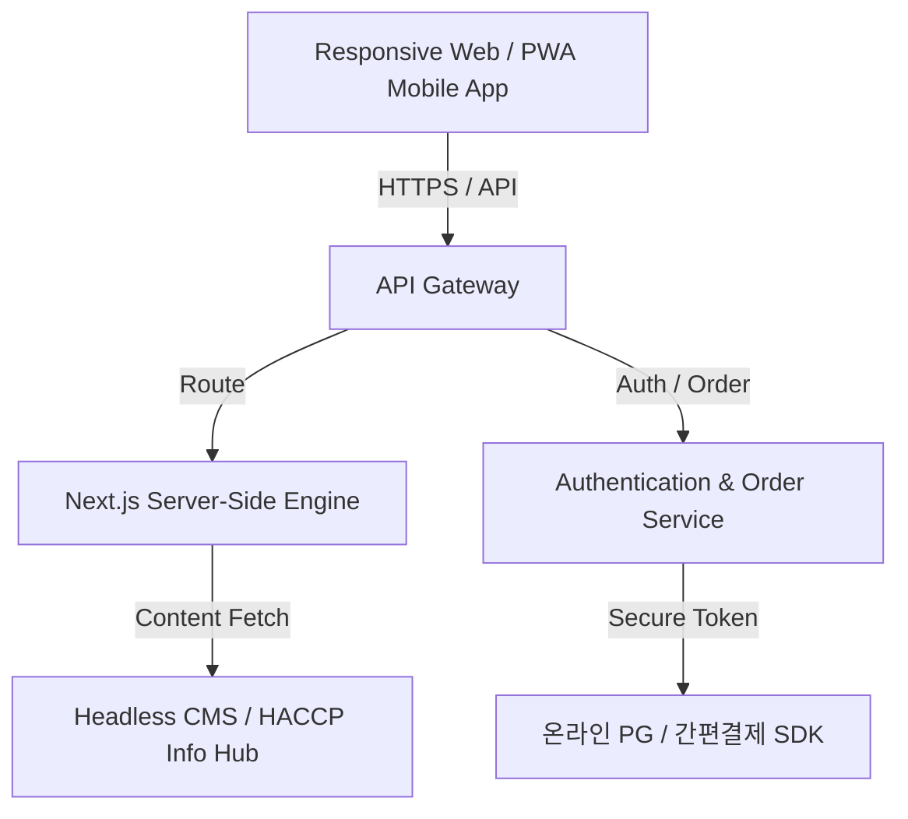

# 🌌 순대 ODM 온오프라인 통합 크로스플랫폼 쇼핑몰 구축 제안서

본 제안서는 순대를 온오프라인 채널로 유통하고 대량/소량 판매를 하고자 하는 브랜드를 대상으로, 최신 웹/앱 아키텍처와 결제 연동, 제조업체(ODM) 협약 시너지 모델, 그리고 차세대 검색 AI 노출 전략(SEO/AEO/GEO)을 총망라한 엔터프라이즈급 비즈니스 및 기술 구축 제안서입니다.

---

## 1. 프로젝트 개요 및 비즈니스 비전

### 1.1 배경 및 목적
순대 시장은 전통적인 로컬 맛집 중심에서 밀키트 및 온라인 HMR(가정간편식) 시장으로 빠르게 확대되고 있습니다. 본 브랜드는 제조 설비를 직접 투자하는 대신, 전문 위생 제조업체와의 **ODM(Original Design Manufacturer) 제휴**를 맺어 리스크를 최소화하고 판매 및 유통 브랜딩에 집중하고자 합니다.

### 1.2 ODM 상호 홍보(윈윈) 협약 모델
제조 파트너 공장은 고도의 위생 설비와 해썹(HACCP) 인증을 보유하고 있으나, 자체적인 온라인 B2C 마케팅 역량이 부족한 경우가 많습니다. 본 홈페이지 구축 모델은 이러한 점을 전략적으로 활용합니다.

```
[제조업체 (ODM 공장)] 
  - HACCP 위생 설비, 생산 자동화 공정 정보 제공
  - 독점 가격 경쟁력 및 안정적인 제품 공급
        ▲
        │ (상호 마케팅 협약 및 지면 지원)
        ▼
[판매 브랜드 (크로스플랫폼 쇼핑몰)]
  - 홈페이지 전면에 공장의 '청결 제조 공정' 투명하게 홍보 (소비자 신뢰 획득)
  - 온오프라인 판매 마케팅 및 브랜드 가치 극대화
```

---

## 2. 실제 접속 가능 홈페이지 벤치마킹 및 벤치마크 결과

프로젝트의 실효성 높은 기능을 설계하기 위해, 국내에서 활발하게 서비스를 운영 중인 실제 순대 제조업체 및 쇼핑몰들을 분석하여 핵심 기능을 도출했습니다.

### 2.1 벤치마킹 대상 업체 및 분석
1. **신창식품 (신토리)**: `http://sintory.co.kr`
   - **특징**: 병천순대, 토종순대 등 다양한 가공 순대를 제조하여 전국 국밥 체인점에 도매 납품하는 전문 기업.
   - **벤치마킹 포인트**: 도매 주문 상담 폼 및 사업자 전용 벌크(Bulk) 구매 안내 지면의 직관성.
2. **병천아우내식품**: `http://aunaefood.co.kr`
   - **특징**: 60년 전통 병천순대를 HACCP 공정에서 대량 생산하며, 자사 쇼핑몰 및 오픈마켓에서 활발히 유통.
   - **벤치마킹 포인트**: 공장의 위생 인증서, 특허증, HACCP 제조 라인의 사진과 청결 상태를 대대적으로 홍보하여 고객 신뢰도 극대화.
3. **보승식품**: `https://www.boseung.co.kr`
   - **특징**: 종합 육가공 및 순대/족발 제조 기업으로 대형 브랜드 편의점 및 식당 프랜차이즈 OEM/ODM 주력.
   - **벤치마킹 포인트**: 대기업 파트너십 이력 노출관 및 브랜드 스토리 텔링 중심의 UI/UX 설계.

---

## 3. 크로스플랫폼 홈페이지 제작 및 기술 아키텍처

쇼핑몰은 웹 브라우저뿐만 아니라 안드로이드/iOS 하이브리드 앱 웹뷰에서도 네이티브 앱처럼 동작해야 하며, 오프라인(매장, 행사)에서도 QR 결제가 원활해야 합니다.



### 3.1 기술 스택 및 크로스플랫폼(PWA) 구성
- **프론트엔드**: **Next.js 14+ (App Router)** & **React**
  - 단일 코드베이스로 PC 웹, 태블릿, 모바일 화면을 완벽히 흡수하는 반응형 그리드.
  - **PWA (Progressive Web App)** 지원: 오프라인 캐싱, 홈 화면에 앱 아이콘 추가, 모바일 푸시 알림(Push Notification) 송신 가능.
- **콘텐츠 관리**: **Headless CMS (Strapi)**
  - ODM 공장의 위생 검사 성적서, 신제품 출시 사진, 브랜드 스토리 등을 웹 개발 지식 없이 관리자가 실시간 갱신 가능.
- **데이터베이스**: PostgreSQL (안정적인 주문 결제 트랜잭션 관리).

### 3.2 온라인 결제 아키텍처 (Easy Payment Integration)
- **통합 결제 게이트웨이(PG)**: 토스페이먼츠 / 나이스페이먼츠 등 연동.
- **간편결제 모듈 필수 통합**:
  - **네이버페이 / 카카오페이 / 토스페이**: 모바일 결제 전환율을 50% 이상 향상시키는 핵심 결제수단.
  - **애플페이 / 삼성페이**: 모바일 브라우저 및 하이브리드 웹뷰 내 바이오 인증(지문/FaceID)을 통한 1초 간편 결제 구현.
- **보안 가이드**: PG 결제 데이터 변조를 막기 위해 웹훅(Webhook) 검증 방식을 도입하고, 모든 통신은 TLS 1.3 암호화를 강제합니다.

---

## 4. 발견 가능성 극대화 전략 (SEO / AEO / GEO)

현대의 검색 시장은 단순히 키워드를 검색하는 검색엔진(SEO)을 넘어, AI 대화형 답변 엔진(AEO)과 생성형 추천 검색엔진(GEO)으로 변화하고 있습니다. 이에 최적화된 3대 전략을 제안서에 내장합니다.

```
┌─────────────────────────────────────────────────────────────────────────┐
│                           [3-Way Search Optimization]                   │
├───────────────────┬──────────────────────────────┬──────────────────────┤
│ 1. SEO (SEO봇)     │ 2. AEO (LLM 답변 인출)        │ 3. GEO (AI 추천엔진)  │
├───────────────────┼──────────────────────────────┼──────────────────────┤
│ - HTML5 시맨틱    │ - 자연어 Q&A 지식 구조화     │ - 권위 있는 출처 링크│
│ - JSON-LD Schema  │ - FAQ 데이터 구축            │ - 보도자료 및 특허 인용│
│ - 로딩 속도 최적화│ - 풍부한 원스톱 정보 제공   │ - 위생/품질 평판 연계│
└───────────────────┴──────────────────────────────┴──────────────────────┘
```

### 4.1 SEO (Search Engine Optimization) 전략
1. **JSON-LD 구조화 데이터 스키마 적용**:
   - `Product` 스키마: 순대 제품의 가격, 재고 상태, 평점을 구글 검색 결과에 리치 스니펫(Rich Snippets)으로 직접 노출.
   - `LocalBusiness` 및 `Organization` 스키마: 판매 브랜드와 ODM 협약 공장의 실주소, 연락처, 비즈니스 정보를 구조화하여 로컬 검색 노출율 향상.
2. **시맨틱 마크업**: `main`, `section`, `article`, `header`, `footer`의 명확한 마크업 및 모든 이미지에 alt 속성(나노바나나 제작 이미지 정보 반영) 부여.

### 4.2 AEO (Answer Engine Optimization) 전략
대화형 AI(예: ChatGPT, Gemini) 및 AI 가상 비서가 "HACCP 순대를 가장 깨끗하게 만드는 ODM 공장은 어디인가요?" 혹은 "순대국 밀키트의 올바른 조리법은?"이라는 질문을 받았을 때 당사의 지식을 명확히 인출할 수 있도록 최적화합니다.
- **자연어 FAQ 구조화**: Q&A 형식의 콘텐츠를 웹페이지 하단에 상시 배치.
- **정확한 명명**: 브랜드명, ODM 파트너십의 고유한 사실(Fact)을 구조화된 텍스트로 단순하고 명확하게 진술.

### 4.3 GEO (Generative Engine Optimization) 전략
생성형 AI 검색 엔진(Perplexity, Google SGE 등)이 신뢰할 수 있는 소스로서 당사 웹사이트를 참조하고 추천 리스트에 포함하도록 신뢰도 네트워크를 마크업합니다.
- **신뢰 링크 마크업**: 특허증, HACCP 인증기관 공인 링크, 연구 논문(예: "순대 저온 살균 기술이 유통기한에 미치는 영향" 등), 공신력 있는 언론 보도(PR) 기사 링크를 사이트 내에 명시적으로 연결하고 인용 구조(Sources)로 처리.
- **권위 있는 평판 관리**: 웹상의 외부 리뷰 플랫폼 및 소셜 피드의 긍정적 지표가 AI 학습 모델에 자연스럽게 잡히도록 평판 데이터 연계.

---

## 5. 홍보 및 온오프라인 마케팅 로드맵

### 5.1 B2B 오프라인 납품 연계 마케팅
- **무료 샘플 신청 프로세스**: 전국의 식당 점주들이 홈페이지에서 사업자 등록증을 첨부하여 'ODM 순대 무료 샘플'을 신청할 수 있는 B2B 간편 창구 운영.
- **QR 코드 연계 마케팅**: 오프라인 팝업스토어 및 제휴 국밥 매장 테이블에 QR 코드를 배치하여, 모바일로 스캔 즉시 쇼핑몰 회원가입 및 가정용 밀키트 정기 배송 구독 신청 결제로 연동.

### 5.2 온라인 콘텐츠 마케팅
- **공장 투명성(HACCP) 라이브 스트리밍/영상 콘텐츠**:
  - 나노바나나 AI 프롬프트로 기획된 위생적인 공정 이미지를 그래픽 모션으로 제작하여 사이트에 상시 재생.
  - "우리 아이가 먹는 순대, 어떻게 만들어질까요?" 테마의 제조 공정 스토리텔링.

---

## 6. 결론 및 기대 효과

이 제안서는 전통적인 유통 방식에서 탈피하여, **공장과 브랜드의 전략적 제휴(ODM)를 마케팅의 정점으로 활용**하고 **Next.js PWA 및 차세대 AI 최적화(AEO/GEO)**를 도입하는 최첨단 이커머스 솔루션을 제공합니다.
이를 통해 브랜드는 초기 고정 설비 투자금 제로 상태에서 대기업 수준의 위생 안전 신뢰성을 소비자에게 전달하며, 압도적인 검색 노출을 통해 온오프라인 판매 시너지를 완성할 수 있습니다.
